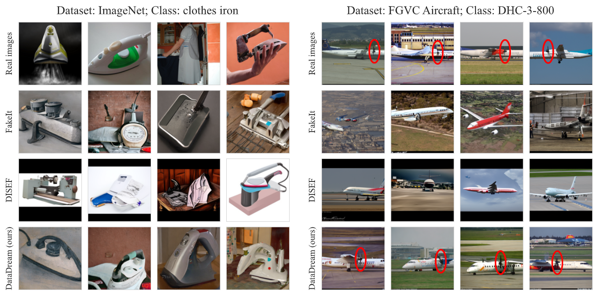

# "DataDream: Few-shot Guided Dataset Generation"

__Authors__: Jae Myung Kim*, Jessica Bader*, Stephan Alaniz, Cordelia Schmid, Zeynep Akata

[](TBD)

### Abstract
While text-to-image diffusion models have been shown to achieve state-of-the-art results in image synthesis, they have yet to prove their effectiveness in downstream applications. Previous work has proposed to generate data for image classifier training given limited real data access. However, these methods struggle to generate in-distribution images or depict fine-grained features, thereby hindering the generalization of classification models trained on synthetic datasets. We propose DataDream, a framework for synthesizing classification datasets that more faithfully represents the real data distribution when guided by few-shot examples of the target classes. DataDream fine-tunes LoRA weights for the image generation model on the few real images before generating the training data using the adapted model. We then fine-tune LoRA weights for CLIP using the synthetic data to improve downstream image classification over previous approaches on a large variety of datasets. We demonstrate the efficacy of DataDream through extensive experiments, surpassing state-of-the-art classification accuracy with few-shot data across 7 out of 10 datasets, with the other 3 comparable. Additionally, we provide insights into the impact of various factors, such as the number of real-shot and generated images as well as the fine-tuning compute on model performance. 



## Preliminary Setup

Before we start, few-shot real data should be formed in the following way. Assuming we use 16-shot, each data files should be located in the path `data/$DATASET/real_train_fewshot/seed$SEED_NUMBER/$CLASS_NAME/$FILE`. The list of `CLASS_NAME` For each `DATASET` can be found in `DataDream/util_data.py` file. 

For instance, the ImageNet 16-shot data should be stored as follows:

```bash
📂 data
|_📂 imagenet
  |_📂 real_train_fewshot
    |_📂 seed0
      |_📂 abacus
        |_📄 n02666196_17944.JPEG
        |_📄 n02666196_10754.JPEG
        |_📄 n02666196_10341.JPEG
        |_📄 n02666196_26262.JPEG
        |_📄 n02666196_16203.JPEG
        |_📄 n02666196_15765.JPEG
        |_📄 n02666196_16339.JPEG
        |_📄 n02666196_7225.JPEG
        |_📄 n02666196_13227.JPEG
        |_📄 n02666196_19345.JPEG
        |_📄 n02666196_19170.JPEG
        |_📄 n02666196_9008.JPEG
        |_📄 n02666196_20311.JPEG
        |_📄 n02666196_17676.JPEG
        |_📄 n02666196_16649.JPEG
      |_📂 clothes iron
      |_📂 great white shark
      |_📂 goldfish
      |_📂 tench
      ...
```


## Step

1. Install the necessary dependencies in `requirements.txt`.
2. **DataDream**: Follow the instructions in the `DataDream` folder.
3. **Dataset Generation**: Follow the instructions in the `generate` folder.
4. **Train Classifier**: Follow the instructions in the `classify` folder.

### Citation
```bibtex
@article{kim2024datadream,
TBD
}
```
